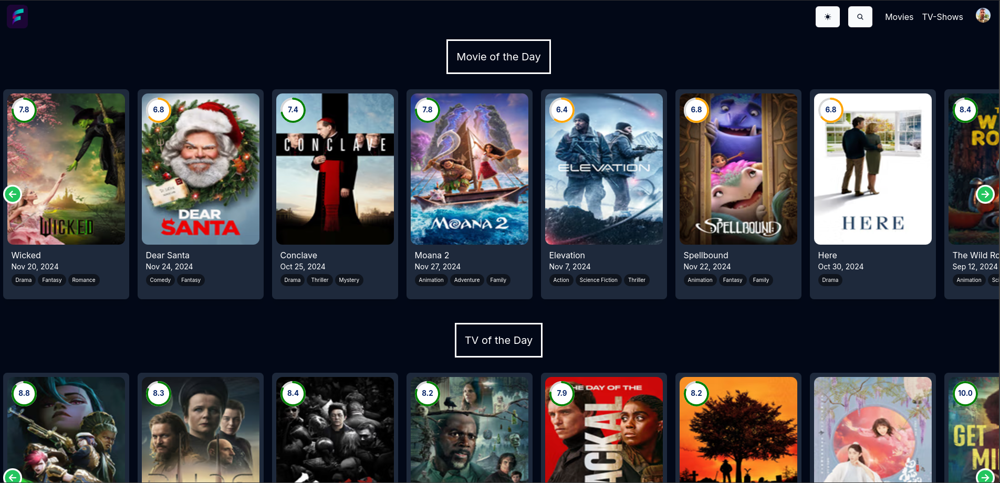
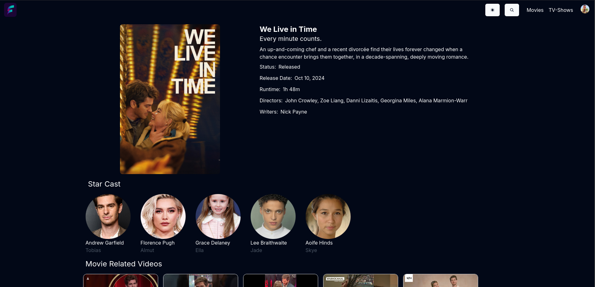

# 🎥 **Filmiflix**  
**Discover, Search, and Explore Movies Effortlessly!**  

🌐 **Live Site:** [filmiflix.netlify.app](https://filmiflix.netlify.app)  
💻 **GitHub Code:** [View Repository](https://github.com/amreshpro/filmiflix)  




---

## 🚀 **About Filmiflix**  
Filmiflix is a modern movie discovery platform for all cinephiles! Whether you’re looking for trending movies, detailed information, or trailers, Filmiflix has it all.  

With its sleek and responsive design, Filmiflix ensures an exceptional user experience across all devices.  

---

## 🌟 **Features**  
- **Trending Movies**: Stay updated with the latest popular titles.  
- **Search Functionality**: Find your favorite movies with real-time search suggestions.  
- **Movie Details**: Access runtime, director, writer, star cast, and trailers.  
- **Responsive Design**: Works flawlessly on desktops, tablets, and mobile devices.  

---

## 🛠️ **Tech Stack**  

| **Technology**   | **Description**                  |  
|-------------------|----------------------------------|  
| **Next.js**       | Framework for building modern web apps |  
| **React.js**      | Component-based frontend library|  
| **Tailwind CSS**  | Utility-first CSS framework     |  
| **TMDB API**      | For fetching dynamic movie data and trailers |  
| **Axios**         | HTTP client for API calls       |  

---

## 📸 **Screenshots**  

### **Home Page**  


### **Movie Details Page**  


---

## 🚀 **Getting Started**  

### **Clone the Repository**  
```bash
git clone https://github.com/amreshpro/filmiflix.git
cd filmiflix
```

### **Install Dependencies**  
```bash
npm install
```

### **Run the Application Locally**  
```bash
npm run dev
```

### **Build for Production**  
```bash
npm run build
```

### **Environment Variables**  
Create a `.env.local` file in the root directory and add your TMDB API key:  
```env
# TMDB 
NEXT_PUBLIC_BASE_URL=https://api.themoviedb.org/3
NEXT_PUBLIC_IMAGE_BASE_URL=https://image.tmdb.org/t/p/original
NEXT_PUBLIC_TMDB_TOKEN=

# Clerk
NEXT_PUBLIC_CLERK_PUBLISHABLE_KEY=
CLERK_SECRET_KEY=
NEXT_PUBLIC_CLERK_SIGN_IN_URL=/sign-in
NEXT_PUBLIC_CLERK_SIGN_UP_URL=/sign-up
```

---

## 💡 **Future Enhancements**  
- Implement **User Authentication** to save personalized watchlists.  
- Add **Multi-language Support** for a global audience.  
- Introduce **Movie Reviews & Ratings** by users.  

---

## 🖊️ **Contributing**  
Contributions are welcome! Here's how you can contribute:  
1. Fork the project.  
2. Create a new branch (`git checkout -b feature/YourFeature`).  
3. Commit your changes (`git commit -m "Add YourFeature"`).  
4. Push to the branch (`git push origin feature/YourFeature`).  
5. Open a pull request.  

---

## 📄 **License**  
This project is licensed under the [MIT License](LICENSE).  

---

## 💬 **Contact**  
If you have any questions, feedback, or ideas, feel free to reach out:  
- **Email**: amresh.terminal@gmail.com  
- **LinkedIn**: [amresh9](https://linkedin.com/in/amresh9)  

---

### ⭐ **If you liked this project, don’t forget to star the repository!**  

---

Let me know if you'd like to include more details or further customize it! 🚀